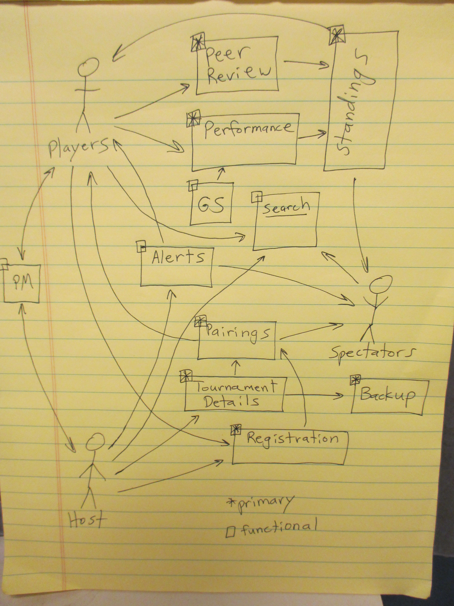

Problem Statement
-----------------

In team-based tournament sports, often individual contributions are
overshadowed by the binary end result: win or lose.  This
winner-takes-all mentality may unfairly pair players in later stages
of the tournament based on the team's score rather than their own in
early stages.

Background
----------

Generally, new team based competitions have been managed
electronically using archaic methods.  The winning team advances and
the losing team is defeated.  In the real world there are many
examples of individual review (as in football) and handicaps (as in
golf).  Our goal is to create software that allows teams to compete
and review their peers to more accurately represent modern team
competitions.  Our domain is online competition management and
e-sports.  The targeted audience is defined on two levels, on a broad
level it is for any individual wishing to manage a competitive event,
on a niche level it is for individuals looking to manage and
participate in team competitions (like League of Legends).

All existing solutions that we found were limited by the binary
win/lose.  Several open-souce options exist, which we could possibly
extend.

The most prominent of these is "XDojo". It has not been modified in
roughly two years, but has been used for several national
tournaments.  Unfortunately, the documentation is not in English.
Because of this, evaluating it for possible adaptation is at the very
least, a spike.

Another current offering is "OMGT" (Open Manager for Game
Tournaments).  It seems to be reasonably well developed and stable,
though the install process is mostly undocumented, and while probably
not very complex, we haven't figured it out yet.

The third current open source offering looked at was "tournamentmngr",
which seems to be unstable/incomplete.  It is written in C#, which
gets in the way of our "easy to install" requirement.

System Model
------------

\ 

Requirements
------------

 - Essential functional requirements
 - Essential non-functional requirements
 - Non-essential functional requirements
 - Non-essential non-functional requirements
 
+---------+-----------------------------------+-----------------------------+
|         | Functional Requirements           | Non-Functional Requirements |
+=========+===================================+=============================+
| Must be | - As a host, I would like to create a new tournament.             | - None                      |
| done    | - As a host, I would like to set some of the parameters of a tournamet, such as number of players per team, whether spectators ar allowed, and game type.  |                             |
|         | - As a player, I would like to register for a tournament.         |                             |
|         | - As a host, I would like to assign members to team, or have the option to randomly assign teams.             |                             |
|         | - As a player, I would like to rate my peers, and would like to be reviewed by my peers.               |                             |
|         | - As a player, or spectator, I would like to see the standings of all players.                       |                             |
|         | - As a host, or a player, I would like my win/rating history to be stored so that I can have the same profile throughout many tournaments.             |                             |
+---------+-----------------------------------+-----------------------------+
| If time | - Alert System                    | - Interactive Menu          |
| allows  | - Private Message System          | - Twitch Integration        |
|         | - Advanced Tournament Search      | - Mobile Access             |
+---------+-----------------------------------+-----------------------------+
